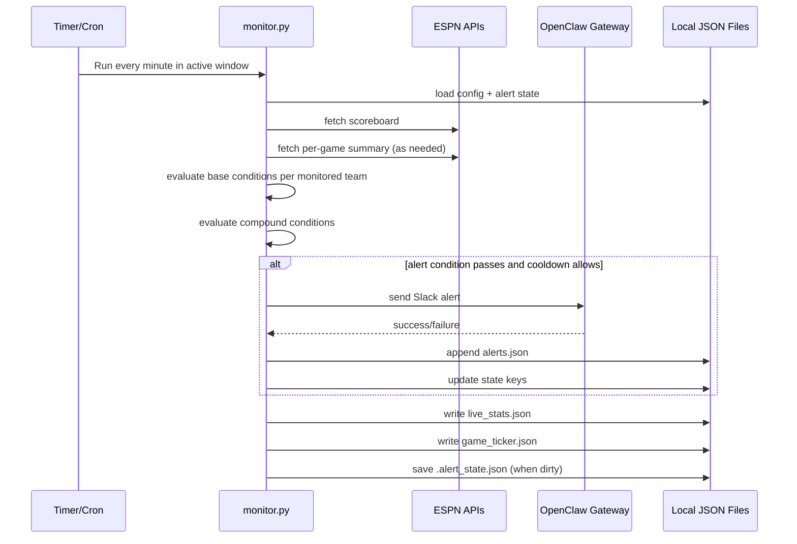
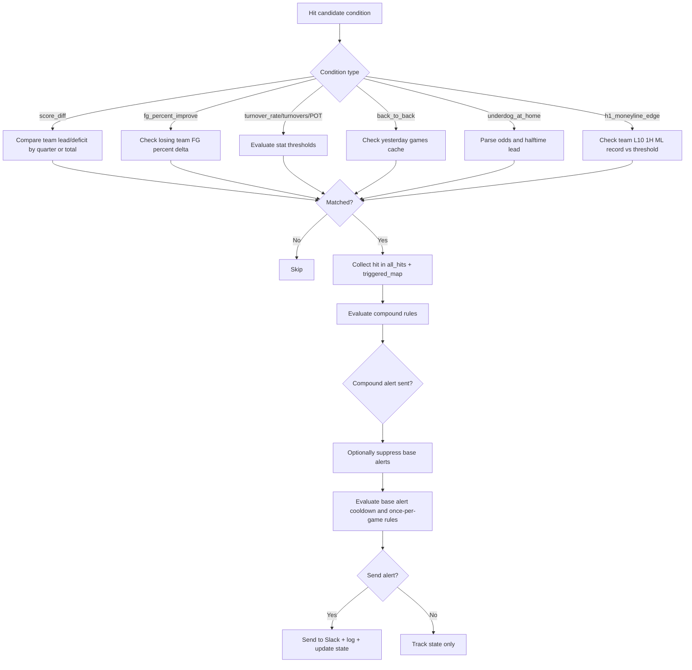

# NBA Monitor

NBA Monitor is a polling-based NBA game intelligence service that evaluates live game conditions every minute, sends alerts to Slack through an OpenClaw gateway, and exposes a local dashboard for operations, configuration, and monitoring.

The project combines four runtime pieces:

1. A polling engine that reads ESPN scoreboard and summary APIs and evaluates alert conditions.
2. A local HTTP server that serves the dashboard and JSON APIs.
3. A single-page dashboard for live visibility and config editing.
4. Scheduler integration (cron and/or systemd timer) to run the monitor continuously during game windows.

## Core Capabilities

- Supports 10 condition types:
  - score_diff
  - consecutive_points_run
  - fg_percent_improve
  - fg_pct_threshold
  - turnover_rate
  - turnovers
  - points_off_turnovers
  - back_to_back
  - underdog_at_home
  - h1_moneyline_edge
- Supports compound conditions with AND/OR logic and optional suppression of base alerts.
- Scopes compound matching by game and team to avoid cross-game/cross-team combinations.
- Enforces cooldown windows to avoid repeated alerts.
- Validates dashboard config saves server-side, including compound reference integrity.
- Uses monitor-produced ticker hits as source-of-truth for live condition pills and Slack-send status in live cards.
- Applies resilient live-game detection (status plus period/clock/score/detail heuristics) and ticker fallback rendering for feed edge cases.
- Dashboard scoreboard proxy merges yesterday+today UTC events so live cards do not disappear at UTC midnight while games from the prior UTC slate are still in progress.
- Live cards show a winning-margin summary (or tie/placeholder) below the scoreline.
- Live matchup title includes team-perspective betting lines and context with placeholders when metadata is unavailable:
  - moneyline
  - spread (team perspective)
  - record
  - streak (computed from regular + postseason completed games)
- Dashboard supports a dry-run live simulation mode when no games are live:
  - append `?simulate_live=1` to the dashboard URL
  - optional: `&simulate_game_id=<eventId>` to pin which event is used as metadata source
- Alert History updates are cache-safe end-to-end:
  - dashboard fetch uses no-store + cache-busting query
  - API responses include no-cache headers
  - alert-log writes use atomic replace to avoid partial read races
- Alert History retains both successful and failed alerts; failed entries show a short `Delivery failed` indicator with a direct link to the matching Monitor Status → Logs detail entry.
- Full delivery failure details are shown in Monitor Status → Logs with timestamps.
- Monitor Status → Logs aggregates delivery failures plus monitor warnings/errors (including disk-space warnings) with timestamps.
- Monitor warning/error events are exposed by the dashboard API (`/api/monitor-log-events`) from user journal output, with fallback to `logs/monitor.log` when needed.
- Monitor runs a disk-space preflight each cycle and publishes host disk metadata into `live_stats.json`.
- Monitor Status shows disk-space health (`OK` / `Low` / `Critical`) with free-space and threshold context.
- Dashboard Control Panel now groups Monitor Status, Configuration, Analysis, and Game History into top-level tabs.
- Game History tab supports paginated browsing of completed games with server-side filters (team, condition, tag, date range, free text), configurable page size, and drill-in condition detail.
- Game History provides facet dropdowns and quick chips (top teams/tags/conditions) sourced from `/api/history-facets` for one-click filtering.
- Game History outcome labels merge legacy booleans (`was_upset`, `was_close`, `was_comeback`) with `postgame_tags_matched` into one deduplicated pill row.
- Game History season-segment filtering supports regular-season and postseason splits; records now use a 4-value taxonomy: `pre_allstar`, `post_allstar`, `playoffs`, `finals`.
- Games are split into separate `Live Games` and `Upcoming Games` tabs while retaining the compact upcoming summary line in the live view.
- Upcoming Games shows scheduled/pre-game matchups in the next 24 hours with pre-game-safe tags such as B2B, configured 1H moneyline strength conditions, and odds-derived underdog/favorite context.
- Pre-game tag chips (B2B, 1H ML edge) are coloured by condition colour derived from live config at render time — colour changes in the UI reflect immediately across all history records without a rebuild.
- `conditions_fired` entries in game history are sorted chronologically by `game_time_seconds` (PBP-derived absolute elapsed time). Pre-game conditions (`quarter_str="PRE"`) always sort first.
- Monitor Status displays timer schedule in a human-friendly summary with both UTC and local timezone labels.
- Scheduler Settings now include a user-friendly OnCalendar helper with Start/Stop/Interval selection fields, quick presets, and a live human-readable preview before save.
- Scheduler can auto-build daily monitor windows from ESPN scheduled game times (first tip minus buffer to last tip plus buffer) and apply the timer automatically.
- Shows live stat splits as 1H/2H/Total for FG, FG%, TO, TO%, and POT.
- Displays FG% and TO% as rounded whole percentages in live stat cards.
- Supports app-level log rotation with configurable cadence:
  - daily
  - weekly
  - monthly
  - custom every 1-99 days
- Includes a Settings panel that detects monitor/dashboard process log outputs and shows whether each is included in the configured rotation file list.
- Includes dashboard scheduler controls to update `nba-monitor.timer` (`OnCalendar` and `Persistent`) and optionally reload/restart the user timer.
- Writes local JSON artifacts for dashboard consumption:
  - alerts.json
  - live_stats.json
  - game_ticker.json
  - .alert_state.json
- Provides a dashboard to:
  - View live games and current condition state
  - Inspect historical alerts
  - Edit and save config.json in place

## Architecture Flow

### 1) Component and Data Flow

```mermaid
python3 backfill.py --fetch-cache --start-date 2024-10-01 --end-date 2025-06-30
    A[Scheduler<br/>cron or systemd timer] --> B[monitor.py]

    B --> C[ESPN Scoreboard API]
python3 backfill.py --use-cache --start-date 2024-10-01 --end-date 2025-06-30 --skip-existing

    B --> E[.alert_state.json]
    B --> F[alerts.json]
python3 backfill.py --use-cache --allow-network-fallback --start-date 2024-10-01 --end-date 2025-06-30 --skip-existing
    B --> H[game_ticker.json]

    B --> I[OpenClaw Gateway]
python3 backfill.py --start-date 2024-10-01 --end-date 2025-06-30 --skip-existing

    K[server.py] --> L[dashboard.html]
    K --> E
python3 backfill.py --start-date 2024-10-01 --end-date 2025-06-30 --skip-existing --resume
    K --> G
    K --> H
    L --> K

    L --> C
```

### 2) Monitor Runtime Sequence



### 3) Alert Decision Pipeline



## Module-by-Module Guide

## 1) monitor.py

Role: Core polling engine and rule evaluator. Runs as a short-lived job (typically once per minute).

### Inputs

- config.json (monitor behavior and condition schema)
- .alert_state.json (cooldowns, B2B cache, fired flags)
- .log_rotation_state.json (persisted rotation cadence state)
- ESPN scoreboard API
- ESPN summary API per game (when stat conditions are enabled)

### Outputs

- alerts.json (recent alert history)
- live_stats.json (current game/team stat snapshot)
- game_ticker.json (active condition hits this run)
- .alert_state.json (updated state)
- .log_rotation_state.json (updated rotation timing state)
- Slack alerts via OpenClaw gateway

### Key Functions

| Function | What it does | Important behavior |
|---|---|---|
| load_config() | Loads config JSON from disk. | Fails if config is malformed or missing. |
| load_state() | Loads persisted state map. | Returns empty map on missing/corrupt state file. |
| save_state(state) | Persists state map. | Writes full JSON with indentation for readability. |
| update_alert_log(entry) | Prepends alert entry to alerts file. | Keeps only latest 20 entries. |
| load_log_rotation_state() | Loads log rotation timing state from disk. | Used to enforce weekly/monthly/custom-day cadence across monitor runs. |
| save_log_rotation_state(state) | Persists log rotation timing state to disk. | Saves only when rotation timing data changes. |
| get_log_rotation_settings(config) | Normalizes log rotation config values. | Supports period values daily, weekly, monthly, days and clamps period_days to 1-99. |
| rotate_logs(config) | Rotates and prunes configured log files. | Uses copy-truncate; retention cleanup still applies for all cadence modes. |
| send_alert(config, message) | Sends message payload to OpenClaw /tools/invoke endpoint. | Adds bearer token header if present; returns boolean success. |
| fetch_summary(game_id, cache) | Fetches ESPN summary for one game. | Uses in-run cache to avoid duplicate HTTP calls per run. |
| extract_team_stats(summary, team_id) | Builds normalized stats dictionary for a team. | Handles ESPN value/displayValue and compound stat strings like 25-59. |
| compute_turnover_rate(stats) | Computes TO rate using possessions approximation. | Formula: TO / (FGA + 0.44*FTA + TO) * 100. |
| extract_team_stat_splits(summary, team_ids, total_stats_by_team, current_period) | Builds per-team 1H/2H/Total split stats payload. | Reconciles totals with official feed and derives in-progress 2H values from Total-1H where valid. |
| extract_scoring_runs(summary, quarter) | Builds chronological unanswered scoring runs from summary plays. | Used by consecutive_points_run to alert once per qualifying run. |
| get_linescore_diff(my_team, opp, quarter_idx) | Returns per-quarter diff from linescores. | Falls back to total score diff if linescore missing. |
| check_b2b(team_id, state, game_id, yesterday_events) | Determines back-to-back status by checking yesterday scoreboard. | Caches result in state keyed by game and team. |
| parse_odds_favorite(odds_detail, competitors) | Determines favorite team id from odds text. | Only supports negative spread favorite notation like DEN -3. |
| halftime_scores(competitors) | Computes halftime score map from Q1+Q2 linescores. | Used by underdog_at_home condition. |
| get_state_key(team_name, cond, quarter, game_id) | Builds cooldown state key per condition scope. | Game-scoped keys for stat/game conditions, quarter-scoped for score_diff. |
| format_score(my_team, opp) | Formats full game score string. | Used in alert and ticker payloads. |
| format_quarter_score(my_team, opp, quarter_idx) | Formats quarter-specific score string. | Used when use_quarter_score is enabled. |
| get_config_warnings(config) | Performs startup config sanity checks. | Warns on invalid names, duplicate names, and bad compound refs. |
| main() | End-to-end run: fetch, evaluate, alert, persist outputs. | Handles scoped compound matching, suppression, cooldown, stale cleanup, and accurate ticker alerted flags. |

### main() Execution Stages

1. Load config and state.
2. Apply log rotation based on cadence policy and persisted rotation state.
3. Emit non-fatal startup warnings for config inconsistencies.
4. Pull live scoreboard.
5. Warm B2B cache for all live teams.
6. Build monitored team pairs per live game.
7. Load per-game stats summary when needed.
8. Evaluate all configured base conditions and collect hits.
9. Evaluate compound conditions scoped per game/team and optionally suppress base alerts.
10. Send base alerts that pass cooldown/suppression logic.
11. Clean stale keys and old fired flags.
12. Write game_ticker.json and live_stats.json.
13. Persist state when changed.

## 2) server.py

Role: Lightweight HTTP server for dashboard and local JSON APIs.

### Responsibilities

- Serves dashboard.html and other static assets.
- Exposes read endpoints for config and runtime files.
- Exposes detected monitor/dashboard log output metadata for dashboard Settings visibility.
- Exposes monitor timer metadata and update controls for dashboard scheduler settings.
- Validates config payloads and writes atomically to avoid partial file corruption.

### Key Class and Methods

| Symbol | What it does | Notes |
|---|---|---|
| validate_config(cfg) | Validates posted config payload structure and references. | Enforces array types, non-empty/unique condition names, and valid compound refs. |
| detect_log_outputs_payload() | Detects active monitor/dashboard log output targets and rotation coverage flags. | Prefers user systemd unit files, falls back to repo templates and defaults. |
| get_monitor_timer_payload() | Reads monitor timer unit metadata for dashboard scheduler controls. | Prefers active user unit and includes `systemctl --user show` runtime state when available. |
| update_monitor_timer(payload) | Writes `OnCalendar`/`Persistent` into the user timer unit file. | Creates `~/.config/systemd/user/nba-monitor.timer` from template if missing, then optionally runs daemon-reload + timer restart. |
| Handler.log_message() | Suppresses default HTTP server access logs. | Keeps terminal/log noise low. |
| Handler.send_json(code, data) | Standard JSON response helper. | Adds CORS header Access-Control-Allow-Origin: *. |
| Handler.do_OPTIONS() | Handles CORS preflight. | Allows GET, POST, OPTIONS and Content-Type header. |
| Handler.do_GET() | Routes GET API endpoints and static file serving. | Endpoints: /api/config, /api/alerts, /api/postgame, /api/history, /api/history-game, /api/history-facets, /api/outcomes, /api/live-analysis, /api/upcoming, /api/live-stats, /api/ticker, /api/log-outputs, /api/monitor-timer, /api/monitor-timer-auto, /api/monitor-log-events. |
| Handler.do_POST() | Handles config and timer updates. | Accepts /api/config and /api/monitor-timer payloads with validation and atomic writes. |

### API Surface

- GET /api/config
- POST /api/config
- GET /api/alerts
- GET /api/postgame
- GET /api/history
- GET /api/history-game
- GET /api/history-facets
- GET /api/outcomes
- GET /api/live-analysis
- GET /api/upcoming
- GET /api/live-stats
- GET /api/ticker
- GET /api/log-outputs
- GET /api/monitor-timer
- GET /api/monitor-log-events
- POST /api/monitor-timer

## 3) dashboard.html

Role: Single-page operations UI for runtime visibility and config management.

The page has four operational zones:

1. Live status and live game cards.
2. Alert history and per-game ticker visibility.
3. Configuration editor (conditions, compounds, settings) with structured compound ref selection.
4. Game History browser with filterable, paginated game rows and drill-in condition detail.
  Includes log rotation controls, scheduler timer controls, and a read-only panel showing detected process output log paths.

---

### Predicted Winner — Live Game Cards

Each live game card shows a **Predicted winner** line above the condition chips and prediction rows. This is a single-team recommendation synthesised from all available prediction evidence.

**Brief summary:** The predicted winner is the team most strongly associated with winning based on the conditions currently active in this game, cross-referenced against historical game data and (when available) the ML model. It is not a guarantee — it reflects how often teams in similar situations have won in the past.

#### How it works (detailed)

1. **Candidate rows** — all prediction rows whose label contains "Team wins" and which name a specific `predicted_team` are collected.
2. **Scoring** — each row is scored using `winner_score_pct` when available, falling back to raw `pct`. `winner_score_pct` is a Bayes-blended score for single-condition rows (see below); for combo and ML rows it equals the raw frequency `pct`.
3. **Best candidate** — the row with the highest score is selected as the predicted winner, and its team + percentage are shown on the card.
4. **Consensus badge** — simultaneously, candidate rows are split into *historical* (frequency/combo) and *ML* buckets. The top scorer from each bucket is compared:
   - `consensus: strong` 🟢 — both sources name the same team
   - `consensus: conflicted` 🔴 — sources disagree on winner
   - `consensus: historical only` 🔵 — only historical data available (ML not loaded or not enough data)
   - `consensus: ml only` — only ML prediction available (no historical rows with a named team)
5. **Blended badge** 🟢 — shown when the winning score came from `winner_score_pct` (a Bayesian blend of frequency and prior). Applied only on single-condition rows with fewer than ~50 effective games; blends the raw frequency toward a calibrated prior to reduce noise on small samples:
   - < 15 effective games: 70% prior / 30% frequency
   - 15–50 effective games: 50% / 50%
   - ≥ 50 effective games: 20% prior / 80% frequency (mostly frequency-driven)
6. **Combo badge** 🔵 — shown when the winning row was derived from a 2–3 condition combo rather than a single condition. Combo rows use raw frequency (no Bayes blending) and typically have smaller sample sizes but higher specificity.

#### What the percentage means

The percentage shown (e.g. **Lakers 71%**) is the `winner_score_pct` (or `pct`) of the selected row — i.e. in historical games where the same condition(s) fired, that team's side won approximately that % of the time. When the blended badge is shown, the number has been smoothed; without it, it is the raw historical frequency.

#### No predicted winner shown

The line is hidden when:
- No conditions are currently active for that game
- No historical "Team wins" rows have a named team (e.g. only generic upset/close predictions)
- The live analysis data hasn't loaded yet

---

### Alert Enrichment Lines — Probability % and Handicap

Every base and compound condition alert can be enriched with two extra sublines. They appear both in the Slack alert body and in the dashboard Alert History entry (the dashboard persists them on each alert entry as `probability_line` and `handicap_line`).

#### Probability % line (win/loss rate when this condition fires)

Example:

```
📈 Leading (+6) — wins 71% of the time when this fires
📉 Trailing (−4) — loses 68% of the time when this fires
```

**Where it is computed:** `monitor._format_condition_probability()` in `monitor.py`, reading from `outcomes.compute_outcomes()` in `outcomes.py`.

**Source data:** every completed game record in `game_history.json` contributes one entry per distinct condition that fired for a monitored team, with a boolean `team_won` label.

**Calculation steps:**

1. **Recency weight per game** (`outcomes._recency_weight`):

   ```
   weight = exp(-outcomes_decay_lambda × days_ago)
   ```

   `outcomes_decay_lambda = 0` disables decay (all games weighted equally). A value like `0.01` gives a half-life of about 69 days.

2. **Weighted win rate per condition** (`outcomes._weighted_mean`):

   ```
   team_wins = (Σ weightᵢ × team_wonᵢ) / (Σ weightᵢ) × 100
   ```

   Values are already in percentage form (0–100) when returned from `compute_outcomes()` — do not multiply by 100 again.

3. **Sample-size gate:** the condition is only eligible if both the raw game count `n ≥ MIN_SAMPLE` (default `3`) **and** the weighted `effective_n ≥ MIN_SAMPLE`. Below that, the probability line is suppressed.

4. **Display threshold:** the line is shown only when either side is dominant enough, controlled by `condition_alert_probability_threshold` in `config.json` (default `65`):

   ```
   win_pct  = team_wins
   loss_pct = 100 − team_wins
   show line if max(win_pct, loss_pct) ≥ threshold
   ```

5. **Direction text** uses `score_margin_at_fire` (team score minus opponent score at the moment the condition fired):
   - `> 0` → `Leading (+N)`
   - `< 0` → `Trailing (−N)` (real minus sign `U+2212`)
   - `= 0` → `Tied`

   `📈` is used when the dominant side is wins; `📉` when the dominant side is losses.

6. **Compound fallback:** for a compound alert, each matched base condition is tried in turn; if none has enough history to show a line, the compound condition's own name is tried as a last fallback. See `monitor.py:2915-2936`.

#### Handicap line (live margin vs. pre-game spread)

Example (JAZZ were 7.5-point favourites pre-game):

```
Line: UTA beating by 2     # leading by 10, beating the −7.5 line by 2
Line: UTA behind by 5      # leading by 3, behind the −7.5 line by 5
Line: UTA right on the line
```

**Where it is computed:** `monitor.format_live_handicap_line(odds_detail, team_abbr, diff_total)` in `monitor.py`.

**Source data:**
- `odds_detail` — ESPN pre-game odds string like `JAZZ -7.5` (favourite abbreviation + signed spread), captured at alert time and stored on the hit record.
- `team_abbr` — the abbreviation of the team that fired the condition.
- `diff_total` — `score_margin_at_fire` = team score − opponent score at the moment the condition fired.

**Calculation steps:**

1. **Parse the odds string:**

   ```
   fav_abbr = first token (upper)
   spread   = second token as float
   ```

   If `spread ≥ 0` (pick-em, bad parse, or no clear favourite), the line is suppressed.

2. **Compute margin vs. the line:**

   ```
   spread_abs = |spread|
   if team_abbr == fav_abbr:    vs_spread = diff_total − spread_abs
   else (underdog):             vs_spread = diff_total + spread_abs
   ```

   Interpretation:
   - If the team is the favourite, they are expected to be up by `spread_abs`; `vs_spread` is their margin *beyond* that expectation.
   - If the team is the underdog, they are expected to be down by `spread_abs`; `vs_spread` is how much better than the line they are doing.

3. **Round and format** (always whole numbers, per issue #81):

   ```
   rounded = round(vs_spread)
   rounded  >  0 → "Line: {TEAM} beating by {rounded}"
   rounded  <  0 → "Line: {TEAM} behind by {|rounded|}"
   rounded == 0 → "Line: {TEAM} right on the line"
   ```

**Worked example** — Utah Jazz firing a condition while leading by 10; pre-game line `JAZZ -7.5`:
- team is favourite, `spread_abs = 7.5`, `diff_total = 10`
- `vs_spread = 10 − 7.5 = 2.5` → `rounded = 2` (Python's `round()` uses banker's rounding on exact halves)
- Output: `Line: UTA beating by 2`

**Dashboard rendering:** `dashboard.html` renders the line under the probability line with colour cues:
- "beating by" → green
- "behind by" → red
- "right on the line" → muted

---

### Key JavaScript Functions

| Function | Area | What it does |
|---|---|---|
| loadLiveStats() | Data loading | Pulls /api/live-stats and stores in liveStats cache. |
| statChipClass(val, type) | Rendering helper | Chooses severity color class based on matching condition thresholds. |
| renderTeamStats(teamId, gameId, isLosing) | Rendering helper | Renders a 1H/2H/Total split table (FG, FG%, TO, TO%, POT) when stats_split is available, with fallback chips otherwise. |
| switchTab(name) | UI behavior | Toggles Conditions / Compounds / Settings tabs. |
| loadConfig() | Data loading | Loads config from /api/config and hydrates editor state. |
| loadLogOutputs() | Data loading | Pulls /api/log-outputs and stores detected output metadata for Settings. |
| loadMonitorTimer() | Data loading | Pulls /api/monitor-timer and stores timer metadata/runtime state for Settings and status card. |
| saveConfig() | Data persistence | Collects all editor data and POSTs config payload to server. |
| saveMonitorTimer() | Data persistence | Saves scheduler changes (`OnCalendar`, `Persistent`) to /api/monitor-timer and optionally reloads/restarts user timer. |
| setStatus(msg, cls) | UI feedback | Updates save status messages in all tab save bars. |
| renderMonitorTimerSettings() | Config editor | Hydrates scheduler timer controls and monitor status timer rows from API data. |
| applyTimerBuilderToOnCalendar() | Config editor | Builds OnCalendar value from Start/Stop/Interval fields and writes it into advanced input. |
| syncTimerBuilderFromOnCalendar(raw) | Config editor | Syncs Start/Stop/Interval fields from compatible daily UTC OnCalendar values. |
| applyTimerPreset() | Config editor | Applies a human-friendly scheduler preset into OnCalendar input. |
| updateOnCalendarPreview() | Config editor | Renders live human-readable schedule preview (UTC + local labels) for current OnCalendar input. |
| condTypeFields(c, i) | Config editor | Returns dynamic form fields for each condition type. |
| renderConditionsEditor() | Config editor | Renders all base condition cards. |
| onTypeChange(idx, sel) | Config editor | Updates condition type and re-renders row layout. |
| onStatusChange(idx, sel) | Config editor | Updates threshold label for trailing/winning mode. |
| addCondition() | Config editor | Appends a new default base condition row. |
| removeCondition(idx) | Config editor | Removes selected base condition row. |
| addCompoundRef(compoundIdx, btn) | Config editor | Adds a selected base condition into a compound reference list. |
| removeCompoundRef(compoundIdx, refIdx) | Config editor | Removes one selected reference from a compound. |
| renderCompoundsEditor() | Config editor | Renders compound cards with dropdown selector, add action, and removable chips. |
| addCompound() | Config editor | Appends a new compound definition row. |
| removeCompound(i) | Config editor | Removes selected compound row. |
| onLogRotationPeriodChange() | Config editor | Shows/hides custom day-interval input when period is set to days. |
| renderDetectedLogOutputs() | Config editor | Renders detected monitor/dashboard output logs and in-rotation status badges. |
| renderSettingsEditor() | Config editor | Hydrates cooldown, team scope, log rotation policy, and detected output panel fields. |
| esc(s) | Utility | Escapes user strings for safe HTML rendering. |
| loadAlerts() | Data loading | Pulls /api/alerts and renders history list with metadata. |
| isMonitored(displayName) | Runtime logic | Returns whether a team should be highlighted as monitored. |
| loadLiveMatchupMeta(liveEvents) | Runtime logic | Loads and caches matchup metadata (moneyline, team-perspective spread, record, streak with placeholders). |
| leadSummary(away, home) | Runtime logic | Returns lead/tie/placeholder text shown below score. |
| renderLiveConditionPills(gameId) | Runtime logic | Renders live condition pills from ticker hits and shows Slack-send status. |
| isEventLive(event) | Runtime logic | Determines live status using ESPN state plus period/clock/score/detail heuristics. |
| renderUpcomingTodayLine(events) | Runtime logic | Renders one upcoming row per game with local, UTC, and game-local start times. |
| loadTicker() | Data loading | Pulls /api/ticker and renders per-game active condition hits. |
| loadHistoryPanel() | Data loading | Loads paginated `/api/history` rows for Game History tab and renders pagination controls. |
| fetchHistoryGame(gameId) | Data loading | Pulls `/api/history-game` for a selected game and renders full condition drill-in detail. |
| refresh() | Orchestration | Main periodic refresh pipeline for all dashboard sections. |
| tickTime() | Utility | Updates current local/UTC clock every second. |

## 4) setup.sh

Role: One-time host bootstrap for this project.

### What it currently does

1. Resolves project path dynamically and prepares logs/executable permissions.
2. Verifies config.json exists (with guidance to copy from config.example.json).
3. Reads OpenClaw gateway/token from config.json and validates they are configured.
4. Installs Python requests dependency if missing.
5. Runs ESPN API and OpenClaw gateway connectivity checks.
6. Prompts for scheduler setup:
  - systemd user timer/service (recommended)
  - cron jobs
  - skip scheduler setup

### Operational Notes

- Script directory is resolved at runtime, so setup can be run from any path.
- OpenClaw gateway and token are read from config.json (no hardcoded token in the script).
- systemd install mode rewrites service paths to your local project directory.
- Cron replacement logic removes existing lines matching nba-monitor or server.py 8899 before writing new entries.

## 5) systemd Units

The systemd directory contains optional unit/timer definitions:

- nba-monitor.service: one-shot monitor run.
- nba-monitor.timer: runs service every minute during 22:00-08:00 UTC.
- nba-dashboard.service: long-running dashboard server on port 8899.
- gog-gmail-renew.service and gog-gmail-renew.timer: unrelated Gmail watch renewal helper included in same folder.

## File and Data Contracts

| File | Produced by | Consumed by | Purpose |
|---|---|---|---|
| config.json | User/dashboard | monitor.py, dashboard.html, server.py | Runtime config and condition schema. |
| .alert_state.json | monitor.py | monitor.py | Cooldowns, B2B cache, fired flags. |
| .log_rotation_state.json | monitor.py | monitor.py | Log rotation cadence baseline state for weekly/monthly/custom intervals. |
| alerts.json | monitor.py | dashboard.html via server.py | Recent alert history (latest 20). |
| live_stats.json | monitor.py | dashboard.html via server.py | Per-game team stats snapshot for live cards, including teams[].stats_split (h1/h2/total FG, FG%, TO, TO%, POT). |
| game_ticker.json | monitor.py | dashboard.html via server.py | Per-run active condition hits and Slack flag hint. |
| logs/monitor.log | monitor.py | Operator | Monitor execution log and warnings. |
| logs/dashboard.log | server.py | Operator | Dashboard service log. |

### game_history.json — `predicted_winner_calls` field

When `predicted_winner_alert` is enabled, each completed game record includes a `predicted_winner_calls` array logging every alert that fired during that game:

```json
"predicted_winner_calls": [
  {
    "ts":                "2026-04-09T12:45:00Z",
    "predicted_team":    "Boston Celtics",
    "predicted_team_id": "2",
    "pct":               74.0,
    "consensus":         "strong",
    "blended":           true,
    "basis":             "single",
    "quarter":           "Q3",
    "correct":           true
  }
]
```

`correct` is `true` if the predicted team won, `false` if they lost, `null` if the outcome couldn't be determined. The game detail view (History tab → Details → 🎯 Predicted Winner Calls) renders this as an accuracy table with a correctness summary.

## Bulk Backfill Safety

Historical backfill that writes canonical records into `game_history.json` is a gated operational task, not a routine runtime action.

Before any bulk canonical write:

1. complete the approved dry-run and parity validation steps
2. create a dated runtime snapshot of the current state files
3. record the backup location, UTC timestamp, config fingerprint, and pre-write row counts
4. confirm the rollback procedure has been reviewed

**Stop the dashboard service before a full rebuild** to avoid continuous ML model retraining during the write loop (each record write updates the file mtime, triggering a ~47s retrain on every dashboard refresh cycle):

```bash
systemctl --user stop nba-dashboard.service
# ... run backfill ...
systemctl --user start nba-dashboard.service
```

Recommended pre-write backup set:

- `game_history.json`
- `live_analysis.json`
- `alerts.json`
- `live_stats.json`
- `game_ticker.json`
- `bayes_state.json`
- `h1_records.json` when that derived store is in use

If a backfill run causes unexplained outcome shifts, schema issues, or live-analysis regressions, restore the pre-write runtime snapshot before resuming normal monitoring.

The full rollback runbook for bulk backfill operations is documented in `SPEC-historical-backfill.md`.

Dry-run command examples (no canonical writes in MVP):

```bash
# Build local ESPN cache first (recommended before replay iterations)
python3 backfill.py --fetch-cache --start-date 2024-10-01 --end-date 2025-04-30

# Replay from cache (requires prior --fetch-cache for the same window)
python3 backfill.py --use-cache --start-date 2024-10-01 --end-date 2025-04-30 --skip-existing

# Optional fallback when cache coverage is partial
python3 backfill.py --use-cache --allow-network-fallback --start-date 2024-10-01 --end-date 2025-04-30 --skip-existing

# Full 2024-25 regular-season dry-run window
python3 backfill.py --start-date 2024-10-01 --end-date 2025-04-30 --skip-existing

# Resume from backfill_state.json checkpoint
python3 backfill.py --start-date 2024-10-01 --end-date 2025-04-30 --skip-existing --resume

# Extend parity scope with one extra condition type for validation experiments
python3 backfill.py --start-date 2025-03-01 --end-date 2025-03-07 --allow-condition-type turnovers

# Run overlap parity validation against existing live history rows
python3 parity_validate.py --start-date 2026-03-28 --end-date 2026-03-30 --max-examples 10

# Fingerprint-gated parity (default): compares only rows with matching config_fingerprint
# and reports skipped_config_fingerprint_mismatch / skipped_legacy_config_fingerprint
python3 parity_validate.py --start-date 2026-03-29 --end-date 2026-03-31 --report-file parity_report.json --max-examples 10

# Sample parity replay check with count-level assertion gate (+/-1%)
python3 parity_check.py --sample 10 --use-cache --count-tolerance-pct 1.0
```

Important: use-cache mode expects cache files to already exist. Run a matching fetch-cache window first, or use allow-network-fallback for partial-cache troubleshooting.

**Full canonical rebuild (2023-24 + 2024-25 + 2025-26 seasons):**

```bash
systemctl --user stop nba-dashboard.service
rm -f game_history.json h1_records.json
python3 backfill.py \
  --use-cache \
  --write-canonical \
  --allow-network-fallback \
  --start-date 2023-10-01 \
  --end-date $(date -d yesterday +%Y-%m-%d) \
  2>&1 | tee logs/backfill-rebuild-$(date +%Y%m%d-%H%M%S).log
systemctl --user start nba-dashboard.service
```

## Configuration Reference

Top-level config keys in config.json:

- teams: list of team name fragments when monitor_all_teams is false.
- monitor_all_teams: true monitors all live teams.
- slack_channel: Slack channel id for alert delivery.
- slack_channel_name: display label for dashboard only.
- slack_bot_token: Slack bot token (`xoxb-...`) for direct Slack API delivery. When set, alerts are sent via `chat.postMessage` directly instead of routing through the OpenClaw gateway. Recommended — avoids gateway tool-policy restrictions.
- openclaw_gateway: base URL for OpenClaw gateway (fallback delivery path when slack_bot_token is absent).
- openclaw_token: bearer token for gateway auth (fallback path only).
- alert_cooldown_minutes: cooldown for repeated alerts.
- end_of_game_alerts: send a final score alert when a monitored game ends (default true).
- postgame_summary_hours: how long post-game summary cards stay visible in dashboard (hours).
- outcomes_decay_lambda: recency-decay factor for `/api/outcomes` and live prediction percentages. `0` disables decay.
- outcomes_max_combo_size: maximum condition combination size for analysis (2-5, default 3). Controls both server computation and dashboard display.
- live_analysis_filter_enabled: enables inline Live Game Analysis prediction-line filtering in dashboard.
- live_analysis_filter_min_pct: minimum probability percentage shown when filtered view is active (0 to 100).
- live_analysis_filter_show_filtered_only: default dashboard view mode for live analysis lines (`false` shows all, `true` shows filtered lines only).
- postgame_outcome_criteria: controls upset/close/comeback thresholds, ordering, and suppression behavior.
- log_rotation: log rotation policy (enabled flag, period, optional period_days, retention, file list).
- conditions: base condition list.
- compound_conditions: grouped condition rules.
- predicted_winner_alert: predicted winner alerting configuration (see below).

### Predicted winner alert (predicted_winner_alert)

Fires when the live analysis predicted winner confidence reaches a configured threshold. Operates independently of base conditions — it reads the live analysis output each polling tick rather than game events.

```json
"predicted_winner_alert": {
  "enabled": true,
  "threshold_pct": 70,
  "alert": true,
  "cooldown_minutes": 5
}
```

| Field | Type | Default | Description |
|---|---|---|---|
| `enabled` | bool | `false` | Enable/disable the feature. |
| `threshold_pct` | int | `70` | Minimum confidence % to trigger. Range 50–99. |
| `alert` | bool | `true` | Send Slack message on trigger. `false` = log to alert history only. |
| `cooldown_minutes` | int | `5` | Per-game, per-team cooldown. If the predicted team changes mid-game, the new team triggers immediately regardless of cooldown. |

**Accuracy tracking:** Each trigger is saved as a call snapshot against the game. When the game ends, `correct: true/false` is resolved against the actual winner and stored in `game_history.json` under `predicted_winner_calls`. Two places surface accuracy data:

- **History tab → game Details → 🎯 Predicted Winner Calls** — per-call table with ✅/❌/❓, confidence %, quarter, basis badges, and a correctness summary for that game.
- **Analysis tab → 🎯 Predicted Winner Accuracy** — aggregate metrics across all games: overall accuracy %, correct/total calls, and breakdowns by confidence band (50/60/70/80/90%), consensus type (strong / conflicted / historical only / ml only), and quarter when the call was made. Accuracy % is colour-coded green ≥70% / yellow ≥50% / red <50%. Each breakdown table also shows a **Games** count (distinct games contributing calls to that bucket). Rows show a distinct games count and are **clickable** — clicking drills through to the History tab filtered to games in that group, with a **Winner** column and a **Predicted Winner Calls** column showing per-game call accuracy (e.g. `3/4 correct (75%)`).

**Note:** `predicted_winner_alert` is a top-level key — do not add it inside `conditions[]`. Predicted winner entries are excluded from `conditions_fired` in game history to avoid contaminating the Analysis tab condition stats.

### Outcome weighting (outcomes_decay_lambda)

- Type: number
- Range: 0 to 1
- Default: 0.0
- Behavior: applies exponential recency weighting to historical games used by:
  - `/api/outcomes`
  - live prediction generation in `live_analysis.json`
- Weight formula: `exp(-lambda * days_ago)`
- `0.0` means all historical games count equally (current legacy behavior).
- Example: `0.01` gives a half-life of about 69 days.
- Effective sample gate: rows are shown only when both raw `games >= min_sample` and weighted `effective_n >= min_sample`.
- Dashboard display shows both counts in analysis views: `n (eff. x.y)`.

### Condition combination analysis size (outcomes_max_combo_size)

- Type: integer
- Range: 2 to 5
- Default: 3
- Behavior: controls the maximum size of condition combinations analyzed by:
  - `/api/outcomes` → `combinations` field
  - Dashboard Analysis tab → condition combination rows
- Examples:
  - `2` shows only pairs (Condition A + Condition B)
  - `3` shows pairs and triples (default)
  - `4` shows up to 4-way combos
- Higher values increase computation time but provide more insight into complex multi-condition scenarios
- Changes take effect on next API call (cached result invalidated)

### Bayesian outcome supplements (Phase 2C)

- Bayesian outputs are computed from the same `game_history.json` records used by the frequency-based outcome tables.
- A derived cache file, `bayes_state.json`, stores per-condition Beta posterior counts for:
  - `team_wins`
  - `game_upset`
  - `game_close`
- The cache is automatically rebuilt from history when it is missing or when its saved history fingerprint does not match the current game history.
- `/api/outcomes` includes a `bayesian_conditions` object so the dashboard can show posterior percentages next to the existing weighted frequencies.
- Live prediction rows may include Bayesian supplements as `Bayes NN% (n=x)` when a condition has posterior data.
- Bayesian values are additive only: they supplement the existing weighted-frequency views and do not change the effective-sample gating logic.

### Condition fire-time context fields (Phase 1E)

- New context fields are captured when a condition triggers (not at game end):
  - `score_margin_at_fire`
  - `quarter_elapsed_pct`
  - `home_away_role`
- These fields are persisted into alert entries and copied into `conditions_fired` history rows.
- Legacy history records may not include these fields; missing values are preserved as `None`/absent and should be skipped by downstream consumers when the field is required.

### Post-game tag analytics (Phase 1 — 2026-04-01)

- The game record field `postgame_tags_matched` (list of uppercase tag key strings, e.g. `["UPSET", "BLOWOUT"]`) is now persisted in every game history record written by `monitor.py` and `backfill.py`.
- Tags are evaluated at game end by `monitor.evaluate_postgame_tag_keys()` against the active `postgame_outcome_criteria.tags` config. All four tag kinds are supported: `upset`, `close_margin_lte`, `margin_gte`, `comeback_q4`.
- Legacy history records (predating 2026-04-01) have an empty list `[]` for this field. They remain valid for all existing analytics; the field is normalized by `outcomes.normalize_game_record()`.
- `compute_tag_outcomes(records, decay_lambda)` in `outcomes.py` computes per-tag hit rates. Only records that have the `postgame_tags_matched` field are included in the denominator (`eligible_games`), so legacy data does not dilute new tag rates.
- `/api/outcomes` now includes a `tag_outcomes` key with the frequency map.
- The Analysis tab in the dashboard shows a **🏷️ Post-Game Tag Analytics** section that renders tag rates as a bar-chart table.

### Post-game outcome criteria schema (postgame_outcome_criteria)

- close_margin: integer 1-30, final margin threshold for CLOSE GAME.
- comeback_deficit: integer 1-40, required deficit entering Q4 for COMEBACK detection.
- close_when_upset: true/false. If false, CLOSE tag is suppressed when UPSET is also true.
- outcome_order: array of 3 unique values from UPSET, CLOSE, COMEBACK.
- require_q4_pbp_for_comeback: true/false. If true, COMEBACK requires Q4 play-by-play score evidence and does not use fallback.
- tags: optional array of post-game tag definitions for dynamic summary labels.

Tag definition fields:

- key: unique identifier (A-Z, 0-9, underscore), e.g. `BLOWOUT`.
- label: display text shown in summary alerts and dashboard pills.
- emoji: optional emoji prefix.
- kind: one of:
  - `upset`
  - `close_margin_lte`
  - `comeback_q4`
  - `margin_gte`
- threshold: required for `close_margin_lte`, `comeback_q4`, `margin_gte`.
- color: one of `red`, `orange`, `yellow`, `green`, `blue`, `muted`.
- enabled: true/false.
- suppress_if_tags: optional list of tag keys that suppress this tag when already matched.

Example BLOWOUT tag:

```json
{
  "key": "BLOWOUT",
  "label": "BLOWOUT",
  "emoji": "💥",
  "kind": "margin_gte",
  "threshold": 15,
  "color": "orange",
  "enabled": true
}
```

### Log rotation schema (log_rotation)

- enabled: true/false.
- period: one of daily, weekly, monthly, days.
- period_days: required when period is days; integer 1-99.
- retention_days: keep rotated logs for this many days.
- files: list of log file paths (relative to project root or absolute paths).

Notes:

- For period daily, weekly, or monthly, period_days is ignored.
- Dashboard/API validation enforces period_days when period is days.

Default in project configs:

- logs/monitor.log
- logs/dashboard.log

### Base condition schema (conditions[])

Common fields:

- name
- type
- color
- alert
- description

Type-specific fields:

- score_diff:
  - quarter
  - team_status (winning or trailing)
  - use_quarter_score
  - min_lead (winning by at least X)
  - max_deficit (trailing by less than X)
  - min_deficit (trailing by at least X)
- consecutive_points_run:
  - threshold (minimum unanswered points)
  - scope (game or quarter)
  - quarter (required when scope is quarter)
- fg_percent_improve:
  - threshold
- fg_pct_threshold:
  - threshold (target FG% value)
  - direction (above, below, or equals)
  - scope (game, quarter, or half)
  - quarter (required when scope is quarter; 1-4)
  - half (required when scope is half; 1 for H1, 2 for H2)
- turnover_rate:
  - threshold
- turnovers:
  - threshold
- points_off_turnovers:
  - threshold
- back_to_back:
  - scope: game
- underdog_at_home:
  - min_lead
  - scope: game
- h1_moneyline_edge:
  - role: home or away
  - l10_min_wins: minimum L10 wins to trigger (strong team threshold; omit if not needed)
  - l10_max_wins: maximum L10 wins to trigger (weak team threshold; omit if not needed)

### Compound schema (compound_conditions[])

- name
- operator (AND or OR)
- description
- condition_refs (base condition names, exact string match to conditions[].name)
- suppress_base_alerts

## Installation and Setup

You can deploy with either the helper script or manual steps.

## Option A: One-command interactive setup

1. From the project directory, run:

```bash
bash setup.sh
```

2. Validate:

```bash
tail -n 50 logs/monitor.log
curl -s http://127.0.0.1:8899/api/config | jq .
```

## Option B: Manual setup (recommended for portability)

### Prerequisites

- Linux host with Python 3.9+.
- Network access to ESPN endpoints.
- OpenClaw gateway reachable from host.
- Slack target channel id.

### Step 1: Install dependency

```bash
python3 -m pip install --user requests
```

### Step 2: Prepare directories

```bash
mkdir -p logs
chmod +x monitor.py
```

### Step 3: Configure config.json

If needed, create your local config from the template first:

```bash
cp config.example.json config.json
```

Update at least:

- slack_bot_token (recommended — direct Slack API delivery)
- openclaw_gateway
- openclaw_token
- slack_channel
- monitor_all_teams and/or teams
- conditions and compound_conditions

### Step 4: Run local smoke test

```bash
python3 monitor.py
python3 server.py 8899
```

Open: http://127.0.0.1:8899/dashboard.html

### Dashboard simulation dry-run (when no games are live)

Use this to validate live-card rendering, matchup metadata placeholders, and score/lead text even when ESPN has no in-progress NBA games.

1. Start dashboard server:

```bash
python3 server.py 8899
```

2. Open simulation mode (full synthetic display):

```text
http://127.0.0.1:8899/?simulate_live=1
```

3. Optional: pin a specific ESPN event as metadata source:

```text
http://127.0.0.1:8899/?simulate_live=1&simulate_game_id=401810887
```

4. Historical replay mode (actual game state for a specific game_id):

```text
http://127.0.0.1:8899/?simulate_live=1&historical_replay=1&simulate_game_id=401810887
```

Notes:
- Valid `simulate_game_id` values are resolved through ESPN summary metadata, even when the event is not on the current scoreboard.
- Invalid `simulate_game_id` values fall back to a generic simulated matchup for that ID instead of reusing the first live game on the page.
- In `historical_replay=1` mode, invalid or missing `simulate_game_id` is treated as an error and shown in the live games panel.

5. Validate expected features in simulation:

**Simulated Data**:
- ✓ Live game event (Q4 2:31) with synthetic team scores
- ✓ Active conditions firing (High Scoring Run, Defensive Hold, Comeback Trail, Lead Change)
- ✓ Condition-level outcome predictions:
  - UPSET upset rate with sample size
  - CLOSE GAME probability (single + combo)
  - COMEBACK rate (combo only)  
  - Team wins prediction with **blended score** and **consensus badge**
- ✓ ML status showing simulation state
- ✓ Consensus badge showing:
  - **strong** — historical and ML agree on predicted winner
  - **conflicted** — historical and ML disagree
  - **historical_only** — ML not yet available
- ✓ Live ticker with active conditions per team
- ✓ Synthetic recent alerts showing what notifications would fire
- ✓ All badges render inline (blended + consensus)

**UI Validation**:
- Live badge shows simulated state ("SIM" marker)
- Score header updates with synthetic data
- Predictions ranked by `winner_score_pct` (blended) with fallback to `pct` (frequency)
- Condition team attribution pills show which team fired each condition
- Alert history displays mock Slack delivery status

5. Exit simulation mode by removing query params and loading the normal dashboard URL.

### Step 5A: Schedule with cron

Add to user crontab:

```cron
* 22-23,0-8 * * * cd /path/to/nba-monitor && python3 monitor.py >> logs/monitor.log 2>&1
@reboot nohup python3 /path/to/nba-monitor/server.py 8899 > /path/to/nba-monitor/logs/dashboard.log 2>&1 &
```

### Step 5B: Schedule with systemd user services

1. Copy units to user systemd folder:

```bash
mkdir -p ~/.config/systemd/user
cp systemd/nba-monitor.service ~/.config/systemd/user/
cp systemd/nba-monitor.timer ~/.config/systemd/user/
cp systemd/nba-dashboard.service ~/.config/systemd/user/
```

2. Edit copied unit files and replace hardcoded WorkingDirectory/ExecStart paths with your local path.

3. Reload and enable:

```bash
systemctl --user daemon-reload
systemctl --user enable --now nba-monitor.timer
systemctl --user enable --now nba-dashboard.service
```

Tip: after this initial setup, you can adjust the timer schedule from dashboard Settings -> Scheduler (systemd timer).

4. Verify:

```bash
systemctl --user status nba-monitor.timer
systemctl --user status nba-dashboard.service
journalctl --user -u nba-monitor.service -n 100 --no-pager
journalctl --user -u nba-dashboard.service -n 100 --no-pager
```

## Operations

Useful commands:

```bash
# Run one monitor cycle
python3 monitor.py

# Start dashboard manually
python3 server.py 8899

# Watch monitor log
tail -f logs/monitor.log

# Watch dashboard log
tail -f logs/dashboard.log
```

Manual systemd restart commands:

```bash
# Reload user unit definitions after editing .service/.timer files
systemctl --user daemon-reload

# Restart dashboard server
systemctl --user restart nba-dashboard.service

# Restart monitor timer schedule
systemctl --user restart nba-monitor.timer

# Trigger one immediate monitor run (oneshot service)
systemctl --user start nba-monitor.service

# Check current service/timer state
systemctl --user status nba-dashboard.service
systemctl --user status nba-monitor.timer
```

Quick API checks:

```bash
curl -s http://127.0.0.1:8899/api/config
curl -s http://127.0.0.1:8899/api/alerts
curl -s http://127.0.0.1:8899/api/postgame
curl -s http://127.0.0.1:8899/api/history
curl -s http://127.0.0.1:8899/api/outcomes
curl -s http://127.0.0.1:8899/api/live-analysis
curl -s http://127.0.0.1:8899/api/model-eval
curl -s http://127.0.0.1:8899/api/model-eval-history
curl -s http://127.0.0.1:8899/api/live-stats
curl -s http://127.0.0.1:8899/api/ticker
curl -s http://127.0.0.1:8899/api/log-outputs
curl -s http://127.0.0.1:8899/api/monitor-timer
curl -s http://127.0.0.1:8899/api/monitor-log-events
```

Chronological evaluation scaffold (Phase 3A prep):

```bash
# Team-win target backtest using rolling-origin splits
python3 evaluate_model.py --target team_wins --min-train 50 --pretty

# Other supported targets: game_upset, game_close, game_comeback
python3 evaluate_model.py --target game_upset --min-train 50 --pretty
```

This tool emits reproducible baseline metrics for frequency and Bayesian predictors:
- Brier score
- Log loss
- Calibration bins + ECE

Phase 3A logistic starter (optional, fail-closed):

```bash
# Install sklearn for Phase 3A training (optional dependency)
python3 -m pip install --user scikit-learn

# Train/save model artifacts from current history
python3 ml_model.py --train --min-train 50 --pretty
```

Artifacts:
- `model.pkl` (derived model artifact)
- `model_meta.json` (schema/version/history metadata)

Runtime behavior:
- If artifacts are present and schema-compatible, live analysis appends `ML:*` prediction rows.
- If artifacts are missing/incompatible, runtime falls back to existing frequency + Bayesian outputs with no interruption.
- `/api/live-analysis` per-game payload now includes `analysis.ml_status` with:
  - `enabled` (whether ML module is available)
  - `ok` (whether artifacts are loadable and inference path is ready)
  - `reason` (status/error reason)
  - `feature_schema_version`, `trained_at`, `predictions_added`

Model-eval snapshots (single-env safe cadence):

```bash
# Manually save one snapshot (throttled to the configured interval unless force=1)
curl -s "http://127.0.0.1:8899/api/model-eval?persist=1"

# Force-save a snapshot (bypass throttle)
curl -s "http://127.0.0.1:8899/api/model-eval?persist=1&force=1"

# Read saved trend history
curl -s http://127.0.0.1:8899/api/model-eval-history
```

Snapshots are stored in `model_eval_history.json` as a derived local artifact and surfaced in Analysis → Model Evaluation.

Snapshot automation is controlled by config:
- `model_eval_snapshot_enabled` — enables/disables automatic snapshotting in the dashboard server process
- `model_eval_snapshot_interval_minutes` — snapshot cadence in minutes (15 to 10080)

With automation enabled, the dashboard server saves a fresh snapshot on the configured interval in the background. Manual saves still work and use the same interval guard unless `force=1` is passed.

## Troubleshooting

- No live games shown:
  - Verify ESPN URL access from host.
  - Outside game windows, this is expected.
  - If this occurs around local morning windows that overlap UTC date rollover, verify `/api/scoreboard` returns merged previous-day and current-day live events.
- Alerts not reaching Slack:
  - Verify openclaw_gateway and openclaw_token in config.
  - Verify slack_channel is correct for your OpenClaw message tool.
- Dashboard shows API unavailable:
  - Ensure you started server.py (not a generic static file server).
- Frequent duplicate alerts:
  - Increase alert_cooldown_minutes.
  - Review condition overlap and compound suppression settings.
- Log rotation save rejected:
  - period must be one of daily, weekly, monthly, or days.
  - if period is days, set period_days between 1 and 99.
  - ensure log file paths match allowed format.
- Timer save from dashboard fails:
  - ensure the dashboard server runs as the same user that owns `~/.config/systemd/user`.
  - if runtime status reports bus/connect errors, verify `systemctl --user` works in that user session.

UTC rollover regression helper:

```bash
python3 test_scoreboard_rollover_helper.py
```

## Cloud Backup

All runtime files (NBA/WNBA + NRL) are synced to Google Drive via `rclone` for disaster recovery.

```bash
# Manual sync (or --dry-run to preview)
./cloud_backup.sh
./cloud_backup.sh --dry-run

# Restore from Google Drive to a fresh machine
rclone copy gdrive:openclaw-backups/nba-monitor/ ~/.openclaw/workspace/scripts/nba-monitor/ --progress
rclone copy gdrive:openclaw-backups/nrl-monitor/ ~/.openclaw/workspace/scripts/nrl-monitor/ --progress
```

- **Schedule:** Twice daily via systemd timer — 09:30 UTC (after NBA/WNBA local backups) and 02:30 UTC (after NRL local backup)
- **Scope:** Runtime state, config (with API keys), ESPN/NRL cache, logs, source code. Excludes `runtime_backups/`, `.git/`, `.venv/`, temp files.
- **Rollback:** Google Drive keeps 100 versions per file for 30 days
- **Storage:** ~1.3GB across all leagues (2TB Drive available)
- **Full rebuild:** See `docs/disaster-recovery.md` for 10-step recovery runbook

## Security and Reliability Notes

- Treat slack_bot_token and openclaw_token as secrets; avoid committing real tokens in source-controlled config or scripts.
- Use config.example.json for onboarding and keep real config.json local.
- systemd template files in systemd/ include example absolute paths; setup.sh systemd mode rewrites them during install.
- Built-in rotation supports daily/weekly/monthly/custom-day cadence; keep configured log_rotation.files aligned with the detected output paths shown in Settings.
